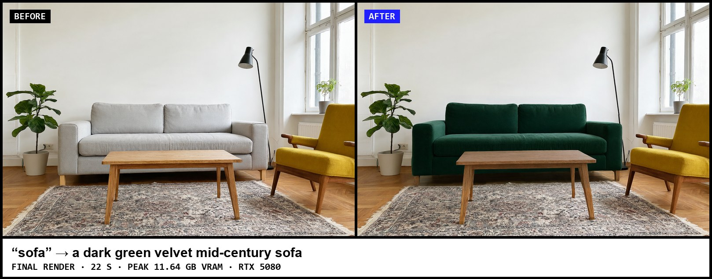
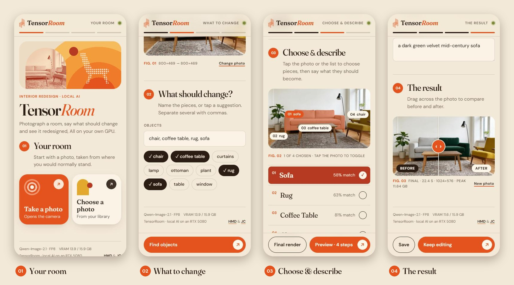
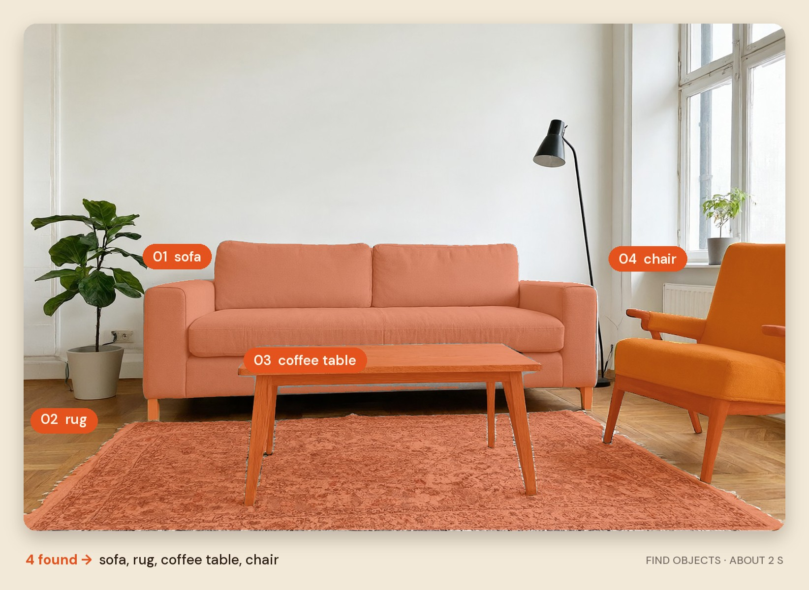
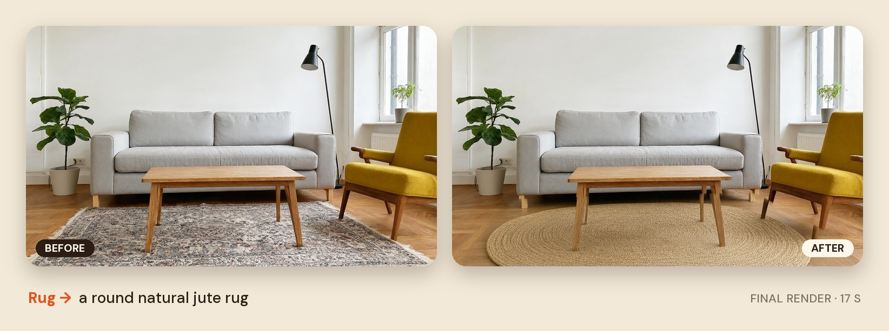
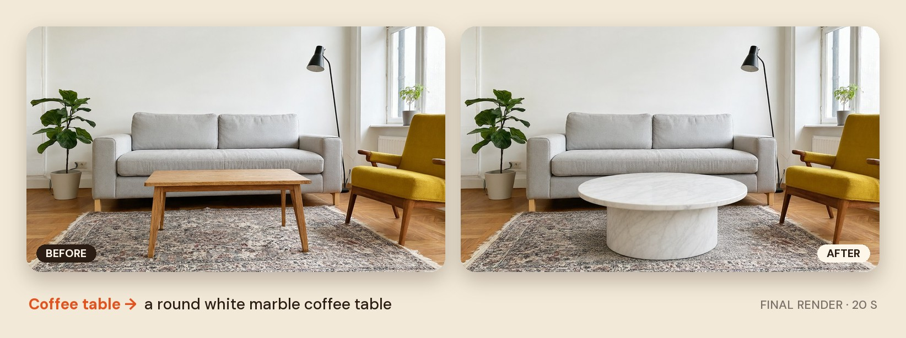
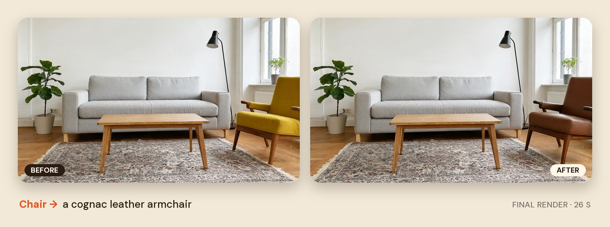
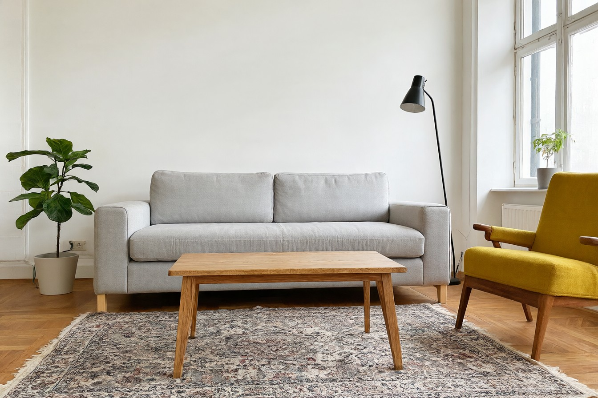

# TensorRoom

**Photograph a room, say what should change, and see it redesigned, all on your own GPU.**

TensorRoom finds the furniture you name in a photo, lets you pick which pieces to change, and redraws only those areas with Qwen-Image-2.1. Everything else in the room stays exactly as it was. It runs entirely locally on a single NVIDIA RTX 5080 (16 GB) and is built to be used from a phone.



## How it works

### 1. Take a photo, pick what to change, get the result

The web app is designed for phones first. Take a photo (or choose one), type or tap the objects to change, tap the matches you want on the photo, and describe the new piece. A preview takes about 12 seconds; drag the slider to compare before and after.



### 2. Find the objects

Your words are matched to objects in the photo (a small dictionary in `config.yaml` maps "couch" to "sofa" and so on), and each match gets a precise mask. Here, "sofa, rug, coffee table, chair" were all found in about 2 seconds:



### 3. Redraw only those areas

Only a crop around the chosen objects is sent to the image model, so a 12-megapixel phone photo edits as fast as a small one. The result is blended back through a soft-edged mask, so pixels outside it are copied byte-for-byte from the original.

| | |
|---|---|
|  |  |
|  |  |

The example room was itself generated by Qwen-Image-2.1. Results vary between runs; if an edit misses, run it again (each run uses a new random seed), sequential editing is possible but can have varying results.

```
phone / browser ──HTTP──▶ server.py   one long-running GPU worker, one job at a time
                            ├─ segmentation   words → object masks (Grounding DINO + SAM, or SAM 3)
                            ├─ masks.py       hull + grow mask → crop around it
                            ├─ editor.py      Qwen-Image-2.1 redraws the crop (4-step preview or full render)
                            └─ masks.py       soft-edged paste-back into the full photo
```

## Performance (measured on an RTX 5080, 16 GB)

| Step | Time | Peak VRAM |
|---|---|---|
| Start-up (load models and warm up) | about 30 s | |
| Find objects | 1 to 2 s | about 3 GB |
| Preview edit (4 steps) | about 12 s | about 12 GB |
| Final render (20 steps) | 17 to 26 s | up to 13.3 GB |

The full-precision models need about 31 GB, so they are fitted into 16 GB like this:

- **Shrunk weights:** the 7B image generator runs in FP8 and the 8B text encoder in 4-bit (NF4), converted once by `scripts/quantise_models.py`.
- **Taking turns on the GPU:** the text encoder and the generator never sit in VRAM together; whichever is idle waits in system RAM.
- **4-step previews:** Alibaba PAI's distilled adapter cuts a 20 to 40 step render to 4 steps.
- **Crop, then paste back:** the model only ever sees a crop of about 1024 px around the chosen objects.

## Models

| Role | Model | Licence |
|---|---|---|
| Image editing | [Qwen-Image-2.1](https://huggingface.co/Qwen/Qwen-Image-2.1) (7B generator, Qwen3-VL-8B text encoder) | Qwen Research Licence, non-commercial |
| 4-step previews | [Qwen-Image-2.1-Fun-Acc-LoRAs](https://huggingface.co/alibaba-pai/Qwen-Image-2.1-Fun-Acc-LoRAs) | Qwen Research Licence, non-commercial |
| Finding objects (default) | [Grounding DINO](https://huggingface.co/IDEA-Research/grounding-dino-base) + [SAM](https://huggingface.co/facebook/sam-vit-huge) | Apache 2.0 |
| Finding objects (preferred) | [SAM 3](https://huggingface.co/facebook/sam3), gated: Meta must approve access | SAM licence |

The original SDXL-Turbo generator (`src/diffusion/generator.py`) and GroundedSAM demo (`src/segmentation/sam.py`) are still in the repo; the GroundedSAM demo needs its own environment (see `requirements-grounded-sam.txt`).

## Getting started

Requires Windows or Linux, an NVIDIA RTX 50-series GPU (16 GB), about 50 GB of disk space and [uv](https://docs.astral.sh/uv/).

```bash
uv sync                                                # CUDA build of PyTorch, diffusers from GitHub
uv run python scripts/check_env.py --probe-sysmem      # checks GPU, libraries and Windows memory settings
uv run python scripts/download_models.py               # about 35 GB
uv run python scripts/quantise_models.py               # one-off: FP8 generator + NF4 text encoder
uv run uvicorn server:app --host 0.0.0.0 --port 8765   # start the worker
```

Then open `http://127.0.0.1:8765` on the PC.

If `check_env.py` reports that Windows' sysmem fallback is on, turn it off (NVIDIA Control Panel → Manage 3D settings → add the venv's `python.exe` → CUDA - Sysmem Fallback Policy → Prefer No Sysmem Fallback). Otherwise running out of VRAM silently spills into system RAM and makes everything several times slower instead of showing an error.

To use SAM 3 once Meta has approved your access: run `uv run hf auth login`, then `uv run python scripts/download_models.py --only sam3`, and set `segmentation.backend: sam3` in `config.yaml`.

### On your phone

- **Same Wi-Fi:** open `http://<PC IP>:8765` (allow Python through the Windows firewall for private networks when asked).

## Configuration

Everything lives in `config.yaml`. The settings most worth knowing:

| Setting | Default | What it does |
|---|---|---|
| `editor.reference_resolution` | 768 | How closely the model reads the photo. 1024 keeps more small details but previews take about 16 s |
| `editor.max_side` | 1024 | Size of the crop the model edits. 768 brings previews to about 10 s |
| `editor.final_steps` | 20 | Steps for "Final render". 30 is slightly more detailed and slower |
| `editor.mask_shape` | hull | `hull` lets the shape change (e.g. four legs to a pedestal); `silhouette` keeps the exact outline |
| `editor.mask_mode` | annotated | How the area is shown to the model. `separate` caused junk transparent areas in testing |
| `segmentation.backend` | grounded_sam | `sam3` once you have access |
| `segmentation.vocabulary` | | The words-to-objects dictionary ("couch" → "sofa") |

## Development

- **Try the app without a GPU:** add `?demo` to the address (e.g. `http://127.0.0.1:8765/?demo`) to click through the whole flow with simulated results.
- **Tests:** `uv run pytest` (mask and crop maths; no GPU needed).
- **Benchmark your own photos:** `uv run python scripts/benchmark.py --images <folder> --terms sofa --instruction "a green velvet sofa"`.
- **Regenerate the README images:** stop the worker, then `uv run python scripts/make_docs_images.py`.

```
server.py              GPU worker (FastAPI): API + serves the web app
web/                   mobile web app (plain HTML/CSS/JS, no build step)
app.py                 Streamlit desktop fallback UI
config.yaml            all settings
src/pipeline.py        segment → crop → edit → paste back
src/diffusion/         editor.py (Qwen-Image-2.1), generator.py (original SDXL-Turbo demo)
src/segmentation/      grounded_segmenter.py, sam3_segmenter.py, masks.py, sam.py (GroundedSAM demo)
src/runtime/           model_manager.py: loads models once, decides what sits on the GPU
src/LLM/, src/RAG/     placeholders for the planned features below
scripts/               environment check, downloads, quantisation, benchmark, README images
```

## Roadmap

- **Natural-language requests:** a small local LLM (Qwen3.5 2B or 4B through Ollama) turns "make the sofa green and swap the rug for something round" into the objects and edits, and summarises what changed.
- **Furniture suggestions:** describe what you want and pick from about three catalogue pieces (local FAISS index with all-MiniLM-L6-v2 embeddings, drag-and-drop choice). Qwen-Image-2.1 accepts reference images, so the chosen product can be drawn into the room.
- **Shopping list:** match the final room's pieces back to the catalogue.
- **Faster previews:** NVFP4 weights for the RTX 50 series' 4-bit tensor cores.
- **Merge into one view** Rather than scrolling through all stages one combined view with back forth arrows.
- **Further user testing and surveys** Get UI/UX testing performed to truly evaluate if its working.
- **Config editing** Allow users to fine tune model settings and more within the app 

## Contributors

- [@Hamish-MarshallDawson](https://github.com/Hamish-MarshallDawson)
- [@JakeCallcut](https://github.com/JakeCallcut)
