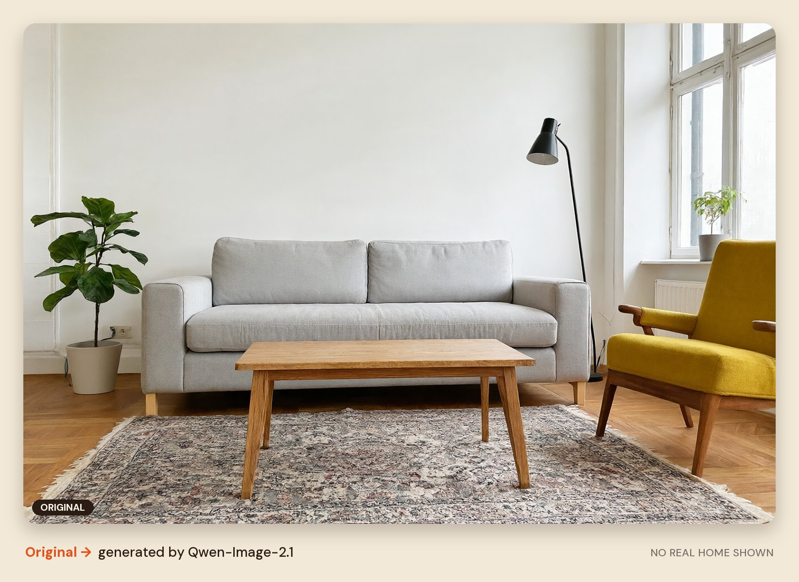

<p align="center"><sub>INTERIOR REDESIGN · LOCAL AI</sub></p>

<h1 align="center">Tensor<i>Room</i></h1>

<p align="center"><b>Photograph a room, say what should change and see it redesigned, all on your own GPU.</b></p>

<p align="center"><i>Photo.</i> &nbsp;·&nbsp; <i>Pick.</i> &nbsp;·&nbsp; <i>Redraw.</i></p>

---

TensorRoom lets you try out new furniture in a room before you buy it. Take a photo of your room, name the pieces you want to change (for example "sofa" or "rug"), describe what they should become, and TensorRoom redraws just those pieces. Everything else in the picture stays exactly as it was.

It runs entirely on your own computer, using its NVIDIA graphics card (GPU), and it is designed to be used from a phone on the same Wi-Fi network.


<sub><b>Fig. 01</b> &nbsp;A grey sofa, redrawn in dark green velvet. Final render, 22 s.</sub>

## What it is for

- **Anyone who wants a cheap, easy way to try out changes to their interior** – see whether a new sofa, rug or table suits a room without needing Photoshop or design skills.
- **People interested in running image diffusion models locally** – everything runs on your own GPU, with no cloud service or subscription.

TensorRoom only edits rooms. If a photo shows a person, it is refused, so it cannot be used to change or redraw anyone.

## How it works

Using TensorRoom takes four steps: photograph, pick, redraw, compare.

### 01 · Your room

The web app is made for phones first: "Take a photo" opens the camera directly. Before anything is stored, the photo is checked for people. A photo of someone is refused, while a portrait, poster or TV on the wall is recognised as part of the room and allowed.


<sub><b>Fig. 02</b> &nbsp;Capture, choose, compare: the whole flow on a phone.</sub>

### 02 · What to change

Type the pieces you want to change, or tap a suggestion. TensorRoom matches your words to objects in the photo. A small dictionary in `config.yaml` maps words to objects (for example "couch" to "sofa"). Each match gets a precise mask, which is a cut-out outline of that object. In the example below, "sofa, rug, coffee table, chair" were all found in about 2 seconds.


<sub><b>Fig. 03</b> &nbsp;Four pieces found, each with its own mask.</sub>

### 03 · Choose and describe

Tap the photo or the list to choose the pieces you want to change, then say what they should become. Only a crop (a cut-out section) around the chosen pieces is sent to the image model, so a 12-megapixel phone photo edits as quickly as a small one. Each mask is first widened to fill in the object's outer outline, so a four-legged table can become a pedestal table.

| | |
|---|---|
|  |  |
| <sub><b>Fig. 04</b> &nbsp;Rug → round natural jute. 17 s.</sub> | <sub><b>Fig. 05</b> &nbsp;Coffee table → round white marble. 20 s.</sub> |
|  |  |
| <sub><b>Fig. 06</b> &nbsp;Armchair → cognac leather. 26 s.</sub> | <sub><b>Fig. 07</b> &nbsp;The original room, itself generated by Qwen-Image-2.1.</sub> |

### 04 · The result

The edit is blended back into the photo through a soft-edged mask. Pixels outside the mask are copied exactly from the original. Drag across the photo to compare the before and after, save the image, or keep editing the result. Every image that leaves the worker carries a small TensorRoom watermark and metadata marking it as partly AI-generated, which photo apps and content checkers can read.

Results vary between runs. If an edit misses, run it again: each run uses a new random seed (the number that sets the starting point for the image). Editing a result again is possible, but the results can vary.

## Performance

<sub>Measured on an RTX 5080, 16 GB.</sub>

| Step | Time | Peak VRAM (graphics memory) |
|---|---|---|
| Start-up (load models and warm up) | about 30 s | – |
| Find objects | 1 to 2 s | about 3 GB |
| Preview edit (4 steps) | about 12 s | about 12 GB |
| Final render (20 steps) | 17 to 26 s | up to 13.3 GB |

The full-size models need about 31 GB of graphics memory, which is more than the card's 16 GB. To make them fit, TensorRoom does the following:

- **Smaller weights:** the 7B image generator runs in FP8 (a compressed number format) and the 8B text encoder in 4-bit NF4 (a very compact format). This is done once by `scripts/quantise_models.py`.
- **Taking turns on the GPU:** the text encoder and the generator never sit in graphics memory together. Whichever one is idle waits in system RAM.
- **4-step previews:** Alibaba PAI's distilled adapter cuts a 20 to 40 step render down to 4 steps, so you get a quick preview first.
- **Crop, then paste back:** the model only ever sees a crop of about 1024 px around the chosen objects.

## Models

| Role | Model | Licence |
|---|---|---|
| Image editing | [Qwen-Image-2.1](https://huggingface.co/Qwen/Qwen-Image-2.1) (7B generator, Qwen3-VL-8B text encoder) | Qwen Research Licence, non-commercial |
| 4-step previews | [Qwen-Image-2.1-Fun-Acc-LoRAs](https://huggingface.co/alibaba-pai/Qwen-Image-2.1-Fun-Acc-LoRAs) | Qwen Research Licence, non-commercial |
| Finding objects (default) | [Grounding DINO](https://huggingface.co/IDEA-Research/grounding-dino-base) + [SAM](https://huggingface.co/facebook/sam-vit-huge) | Apache 2.0 |
| Finding objects (preferred) | [SAM 3](https://huggingface.co/facebook/sam3), gated: Meta must approve access | SAM licence |

Each model keeps its own licence, which applies alongside the TensorRoom licence. The Qwen models are for non-commercial use only. See [Licence](#licence) below.

## Requirements

Before you start, check that you have the following:

- **Operating system:** Windows or Linux.
- **Graphics card:** an NVIDIA RTX 50-series GPU with 16 GB of graphics memory. TensorRoom was measured on an RTX 5080.
- **Disk space:** about 50 GB free. The models alone are about 35 GB.
- **Internet connection:** needed for the first setup, when the libraries and models are downloaded.
- **Git:** needed because one library is installed straight from GitHub.
- **uv:** a free tool that installs Python and the project's libraries for you. You install it in step 1 below.
- **Python 3.11:** you do not need to install this yourself. `uv` downloads it for you.
- **Optional, for the preferred object finder (SAM 3):** a free Hugging Face account. See [Optional: the preferred object finder (SAM 3)](#optional-the-preferred-object-finder-sam-3).

## Installation

Run these steps in a terminal. On Windows, PowerShell works well. Stay inside the project folder for steps 3 to 7.

**1. Install uv.** Follow the instructions at [docs.astral.sh/uv](https://docs.astral.sh/uv/).

**2. Download TensorRoom.** Clone the project from GitHub, then move into its folder.

```bash
git clone https://github.com/Hamish-MarshallDawson/TensorRoom.git
cd TensorRoom
```

**3. Install the libraries.** This downloads the CUDA build of PyTorch (the machine-learning library that uses your GPU) and diffusers from GitHub. It can take a while.

```bash
uv sync
```

**4. Check your setup.** This checks your GPU, the libraries and, on Windows, your memory settings.

```bash
uv run python scripts/check_env.py --probe-sysmem
```

If the check reports that Windows' sysmem fallback is on, turn it off. Open the NVIDIA Control Panel, go to **Manage 3D settings**, add the `python.exe` inside the project's `.venv` folder (`.venv\Scripts\python.exe`), then set **CUDA - Sysmem Fallback Policy** to **Prefer No Sysmem Fallback**. This matters because, with the setting on, running out of graphics memory silently spills into system RAM and makes everything several times slower, instead of showing an error.

**5. Download the models.** This downloads about 35 GB, so it can take a long time on a slow connection.

```bash
uv run python scripts/download_models.py
```

**6. Shrink the models (one-off).** This converts the downloaded models into the smaller formats (FP8 and NF4) described in [Performance](#performance). You only need to do it once.

```bash
uv run python scripts/quantise_models.py
```

**7. Start the worker.** The worker is the program that runs the models and serves the app. Leave this window open while you use TensorRoom. Start-up takes about 30 seconds.

```bash
uv run uvicorn server:app --host 0.0.0.0 --port 8765
```

**8. Open the app.** In a web browser on the same PC, go to:

```
http://127.0.0.1:8765
```

The `--host 0.0.0.0` setting lets other devices on your Wi-Fi network connect. If you want TensorRoom to be reachable from this PC only, use `--host 127.0.0.1` instead.

### On your phone

1. Make sure the phone and the PC are on the same Wi-Fi network.
2. Find the PC's IP address. On Windows, run `ipconfig` and look for **IPv4 Address**. On Linux, run `hostname -I`.
3. On the phone, open `http://<PC IP>:8765`, replacing `<PC IP>` with the address from step 2.
4. If Windows asks whether to allow Python through the firewall, allow it for **private** networks.

## Using TensorRoom

1. **Take a photo.** On a phone, tap **Take a photo** to open the camera. On a PC, tap **Choose a photo**.
2. **Find the objects.** Type the pieces you want to change, separated by commas (for example `sofa, rug, coffee table`), or tap a suggestion, then press **Find objects**.
3. **Choose what to change.** Tap the objects in the photo or in the list. Then describe what they should become (for example "a round natural jute rug").
4. **Edit.** Press **Preview · 4 steps** for a quick check (about 12 seconds). When you are happy with it, press **Final render** for the full-quality result (about 17 to 26 seconds).
5. **Compare and save.** Drag across the photo to compare the original with the result. Press **Save image** to keep it, or **Keep editing** to change it further.

## Optional: the preferred object finder (SAM 3)

TensorRoom uses Grounding DINO and SAM by default. SAM 3 is the preferred option, but Meta must approve your access first.

1. Request access to [SAM 3 on Hugging Face](https://huggingface.co/facebook/sam3) and wait for approval.
2. Log in to Hugging Face from the project folder:

   ```bash
   uv run hf auth login
   ```

3. Download the SAM 3 model:

   ```bash
   uv run python scripts/download_models.py --only sam3
   ```

4. Open `config.yaml` and set `segmentation.backend` to `sam3`.

## Configuration

Everything lives in `config.yaml`. These are the settings most worth knowing about:

| Setting | Default | What it does |
|---|---|---|
| `editor.reference_resolution` | 768 | How closely the model reads the photo. 1024 keeps more small details, but previews take about 16 s |
| `editor.max_side` | 1024 | Size of the crop the model edits. 768 brings previews down to about 10 s |
| `editor.final_steps` | 20 | Steps for "Final render". 30 is slightly more detailed, but slower |
| `editor.mask_shape` | hull | `hull` lets the shape change (for example, four legs can become a pedestal). `silhouette` keeps the exact outline |
| `editor.mask_mode` | annotated | How the area is shown to the model. `separate` caused junk transparent areas in testing |
| `segmentation.backend` | grounded_sam | Which object finder to use. Set it to `sam3` once you have access |
| `segmentation.vocabulary` | | The word-to-object dictionary (for example "couch" → "sofa") |
| `guardrails.block_terms` | person, human face | Words that cause a photo to be refused. `artwork_terms` lists what counts as a picture on the wall |
| `branding.watermark_width` | 0.08 | Watermark size as a fraction of the image width. Set `watermark_enabled` to turn the watermark off |

## Development

- **Try the app without a GPU:** add `?demo` to the address (for example `http://127.0.0.1:8765/?demo`) to click through the whole flow with simulated results.
- **Run the tests:** `uv run pytest`. The tests cover masks, guardrails and branding, and need no GPU.
- **Benchmark your own photos:** `uv run python scripts/benchmark.py --images <folder> --terms sofa --instruction "a green velvet sofa"`.
- **Regenerate the README images:** stop the worker first, then run `uv run python scripts/make_docs_images.py`.

### Project layout

```
server.py              GPU worker (FastAPI): API + serves the web app
web/                   mobile web app (plain HTML/CSS/JS, no build step)
config.yaml            all settings
src/pipeline.py        segment → crop → edit → paste back
src/guardrails.py      refuses photos of people before anything is stored
src/branding.py        watermark + "generated by TensorRoom" metadata on every output
src/diffusion/         editor.py (Qwen-Image-2.1)
src/segmentation/      grounded_segmenter.py, sam3_segmenter.py, masks.py
src/runtime/           model_manager.py: loads models once, decides what sits on the GPU
scripts/               environment check, downloads, quantisation, benchmark, README images
```

## Roadmap

These features are planned but not built yet:

- **Natural-language requests:** a small local language model (Qwen3.5 2B or 4B, run through Ollama) turns "make the sofa green and swap the rug for something round" into the objects and edits, and summarises what changed.
- **Furniture suggestions:** describe what you want and pick from about three catalogue pieces (a local FAISS search index with all-MiniLM-L6-v2 embeddings, with drag-and-drop choice). Qwen-Image-2.1 accepts reference images, so the chosen product can be drawn into the room.
- **Shopping list:** match the final room's pieces back to the catalogue.
- **Faster previews:** NVFP4 weights for the RTX 50 series' 4-bit tensor cores.
- **One combined view:** rather than scrolling through all the stages, one view with back and forward arrows.
- **User testing and surveys:** get UI and UX testing done to properly evaluate whether it works for people.
- **Settings in the app:** let users fine-tune model settings and more from within the app.

## Contributing

Ideas, bug reports and pull requests are welcome on [GitHub](https://github.com/Hamish-MarshallDawson/TensorRoom). Before submitting a change, please run `uv run pytest` and check that it passes.

## Licence

TensorRoom is free software, licensed under the GNU Affero General Public License, version 3 or later. You can use, study, change and share it. If you run a modified version as a service for other people, you must make your modified source code available to those users under the same licence. The full licence text is in [LICENSE](LICENSE).

The AI models TensorRoom uses have their own licences, listed in [Models](#models). Some of them, including the Qwen models, are for non-commercial use only.

## Contributors

- [@Hamish-MarshallDawson](https://github.com/Hamish-MarshallDawson)
- [@JakeCallcut](https://github.com/JakeCallcut)
